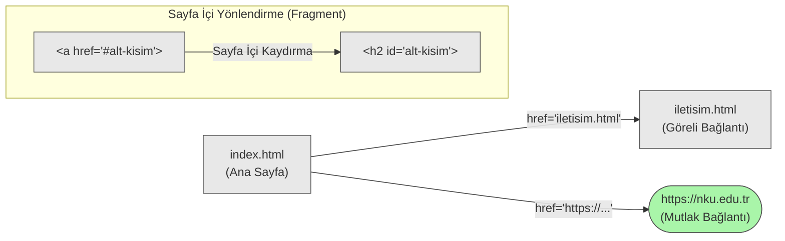

# HTML Bağlantıları: `<a>` Etiketi, href Niteliği ve Yönlendirme Mimarisi

Gençler, web sayfalarının sadece okunabilir durağan metinler olmaktan çıkıp, birbirine bağlı devasa bir ağ (web) oluşturmasını sağlayan temel yapıyı inceleyeceğiz. Bir HTML belgesinde başka bir sayfaya, görsele veya sunucuya geçiş yapmak istediğimizde `<a>` etiketi ve onun ayrılmaz bir parçası olan `href` niteliğini (attribute) kullanırız.

```html
<a href="https://www.nku.edu.tr">Namık Kemal Üniversitesi</a>
```

Bu kod parçasında, açılış ve kapanış etiketleri arasındaki metin ("Namık Kemal Üniversitesi"), kullanıcının ekranda göreceği ve etkileşime gireceği kısımdır. Ancak perdenin arkasında çalışan ve veri paketlerinin hangi sunucuya veya belgeye yönlendirileceğini belirten referans noktası `href` niteliğidir. `href`, **Hypertext Reference** (Hipermetin Referansı) kelimelerinin kısaltmasıdır. Hipermetin, normal okuma sırasının ötesine geçerek başka metinlere atıfta bulunan, onları birbirine bağlayan yapılardır. 

Etiketin ismi olan `a` harfinin nereden geldiğini bilmek, bu mimarinin mantığını kavramanıza yardımcı olacaktır. `a` harfi, İngilizce **Anchor** (Çapa) kelimesinin baş harfidir. Kelimenin kökeni Latince *ancora* sözcüğüne dayanır ve denizcilikte gemiyi belirli bir noktaya sabitlemek için denize atılan demiri ifade eder. Tıpkı bir geminin bulunduğu noktadan denizin dibindeki bir konuma fiziksel bir bağ kurması gibi, anchor etiketi de okuduğunuz mevcut metin ile hedefteki diğer bir belge arasında mantıksal bir bağ kurar; yönlendirmeyi oraya sabitler, yani "demir atar".

## Adresleme Yöntemleri: Mutlak ve Göreli Referanslar

Bağlantıların hedef noktalarını belirlerken, kaynakların bulunduğu konuma göre iki farklı adresleme stratejisi uygularız.

1. **Mutlak Adresleme (Absolute URL - Mutlak Tekdüze Kaynak Bulucu):** Hedef belgenin internet ağındaki tam ve bağımsız konumudur. Genellikle dış kaynaklara veya farklı alan adlarına (domain) bağlantı verirken kullanılır. İletişim kuralı olan protokol (`http` veya `https`) ile başlamak zorundadır.
   ```html
   <a href="https://www.google.com/search?q=html">Google'da HTML Ara</a>
   ```

2. **Göreli Adresleme (Relative URL - Göreli Tekdüze Kaynak Bulucu):** Bağlantı verilen hedef dosya ile mevcut dosyanız aynı proje dizini (directory) içindeyse kullanılır. Bu yöntemde tam adresi yazmak yerine, bulunduğunuz klasöre göre bir yol (path) çizersiniz. Bu yöntem, projeyi yerel bilgisayarınızdan çıkarıp başka bir sunucuya taşıdığınızda bağlantıların kopmamasını sağlar.
   ```html
   <!-- Aynı klasördeki bir dosyaya bağlantı -->
   <a href="iletisim.html">İletişim Sayfası</a>

   <!-- Bir üst dizine çıkıp oradaki dosyaya bağlantı -->
   <a href="../hakkimizda.html">Hakkımızda</a>
   ```

## Sayfa İçi Yönlendirmeler (Fragment Identifiers)

Anchor etiketi her zaman fiziksel olarak farklı bir belgeye gitmek zorunda değildir. Çok uzun bir metin okuyorsanız, sayfanın en üstüne veya belirli bir başlığa doğrudan sıçramak isteyebilirsiniz. Bunun için HTML elemanlarının `id` (Kimlik - Identifier) niteliği kullanılır. `href` değerinin başına kare `#` sembolü (hash) konularak sayfa içindeki belirli bir referansa çapa atılır.

```html
<!-- Sayfanın alt kısımlarında bir başlık -->
<h2 id="veri-yapilari">Veri Yapıları Konusu</h2>

<!-- Başka bir noktadan ilgili başlığa yönlendiren bağlantı -->
<a href="#veri-yapilari">Veri Yapıları bölümüne git</a>
```

## Yönlendirme Davranışı ve `target` Niteliği

Kullanıcı bir bağlantıya tıkladığında tarayıcının yeni belgeyi nasıl açacağını `target` (Hedef) niteliği ile kontrol ederiz. Varsayılan (default) davranış `_self` değeridir; yani sayfa mevcut sekmede açılır. Ancak kullanıcıyı mevcut sayfadan koparmamak için bağlantının yeni bir sekmede açılması istenebilir. Bunun için `_blank` değeri kullanılır.

```html
<a href="belge.pdf" target="_blank">Ders Notunu İndir</a>
```

Bu noktada web güvenliği (web security) açısından önemli bir ayrıntıya değinmemiz gerekir. Bir bağlantıyı `target="_blank"` ile yeni bir sekmede açtığınızda, açılan yeni sayfa, kendisini açan kaynak sayfanın tarayıcı nesne modeline (Document Object Model - DOM) ait belirli özelliklere erişebilir. Özellikle JavaScript tarafındaki `window.opener` nesnesi aracılığıyla, yeni açılan kötü niyetli bir sayfa, kaynak sayfanın adresini değiştirerek kullanıcıyı sahte bir giriş ekranına yönlendirebilir. Bu güvenlik zafiyetine literatürde **Tabnabbing** (Sekme avlama) denir.

Bu riski ortadan kaldırmak için, kullanıcıdan bağımsız dış bağlantılara `target="_blank"` eklendiğinde, `rel` (Relationship - İlişki) niteliğine mutlaka `noopener` ve `noreferrer` değerleri eklenmelidir. Bu işlem, açılan yeni sayfanın kaynak sayfa ile olan bağını (`window.opener` erişimini) tamamen keser.

```html
<a href="https://guvenilmeyen-site.com" target="_blank" rel="noopener noreferrer">Dış Bağlantı</a>
```

## Farklı Protokollerin Kullanımı

Çapa etiketinin `href` niteliği yalnızca web sayfalarına (`http://` veya `https://`) değil, işletim sisteminin diğer varsayılan uygulamalarına da tetikleyici komutlar gönderebilir. 

- **E-posta İstemcisi:** `mailto:` protokolü kullanıldığında, kullanıcının bilgisayarındaki veya telefonundaki varsayılan e-posta uygulaması, belirtilen adrese yeni bir e-posta gönderecek şekilde açılır.
- **Telefon Araması:** `tel:` protokolü, özellikle mobil tarayıcılarda doğrudan arama ekranını tetikler.

```html
<a href="mailto:ornek@nku.edu.tr">E-posta Gönder</a>
<a href="tel:+902822502300">Fakülteyi Ara</a>
```

## Bağlantı Akış Mimarisi

Bağlantıların bir belgeden diğerine ve belge içindeki farklı noktalara olan yönlendirme mantığını aşağıdaki yönlendirme grafiğinde yapısal olarak inceleyebiliriz:



Özetlemek gerekirse, `<a>` etiketi basit bir metin işaretleme işleminden ibaret değildir. Hedefin konumuna göre mutlak veya göreli adreslemeyi kullanmayı, sayfa içi yönlendirmelerle kullanıcı deneyimini artırmayı ve yeni sekme açarken oluşabilecek güvenlik açıklarını `rel="noopener noreferrer"` ile kapatmayı öğrenmek, güvenli ve bütünleşik bir web mimarisi kurmanın temel şartıdır.