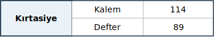
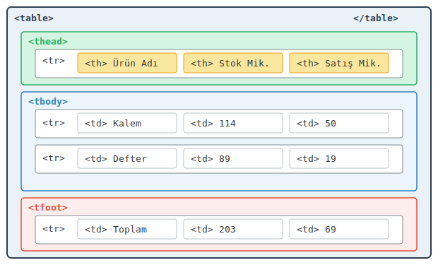

# HTML Tabloları (Tables): Verileri Satır ve Sütunlarda Yapılandırma

Bir veri kümesini insanların hızlıca tarayıp karşılaştırabilmesini sağlayan en eski ve en etkili görsel araç tablodur. Bir ürün listesi, ders programı veya sınav sonuçları düşünün — bu tür bilgileri düz paragrafla aktarmak hem yazan hem okuyan için zahmetlidir. HTML, bu ihtiyaç için `<table>` etiketini sunar.

## Tablonun Anatomisi

Bir HTML tablosu iç içe geçmiş üç temel etiketten oluşur:

| Etiket | Açılımı | Görevi |
|---|---|---|
| `<table>` | Table (Tablo) | Tablonun dış çerçevesidir; tüm satır ve hücreleri sarar. |
| `<tr>` | Table Row (Tablo Satırı) | Bir yatay satırı tanımlar. |
| `<th>` | Table Header (Tablo Başlığı) | Sütun başlıklarını tanımlar. Tarayıcı bu hücreleri varsayılan olarak **kalın** ve **ortalanmış** gösterir. |
| `<td>` | Table Data (Tablo Verisi) | Normal veri hücreleridir. |

Bu etiketlerin birbiriyle ilişkisini bir yapı olarak düşünmek faydalı olur. `<table>` bir dolap, `<tr>` o dolabın rafları, `<th>` ve `<td>` ise raflara yerleştirilen kutulardır. Dolabın dışında raf olmaz; rafın dışında kutu olmaz. Yani `<td>` veya `<th>` doğrudan `<table>` içine yazılamaz — mutlaka bir `<tr>` içinde yer almalıdır.

## İlk Tablo

Bir kırtasiye mağazasının stok ve satış verilerini tablo ile gösterelim:

```html
<table>
  <tr>
    <th>Ürün Adı</th>
    <th>Stok Miktarı</th>
    <th>Satış Miktarı</th>
  </tr>
  <tr>
    <td>Kalem</td>
    <td>114</td>
    <td>50</td>
  </tr>
  <tr>
    <td>Defter</td>
    <td>89</td>
    <td>19</td>
  </tr>
</table>
```

Tarayıcıda bu kod şu tabloyu üretir:

| Ürün Adı | Stok Miktarı | Satış Miktarı |
|---|---|---|
| Kalem | 114 | 50 |
| Defter | 89 | 19 |

Dikkat edilecek nokta: ilk `<tr>` elemanı `<th>` etiketleriyle doldurulmuş, diğer satırlar `<td>` ile. Bu ayrım yalnızca görsel bir tercih değildir; ekran okuyucular (screen readers) ve arama motorları `<th>` etiketine bakarak "bu sütunun ne anlama geldiğini" kavrar. Yani anlamsal (semantic) olarak doğru etiket seçimi, erişilebilirliği (accessibility) doğrudan etkiler.

## Tablonun Yapısal Bölümleri

Büyük tabloları daha okunur ve yönetilebilir kılmak için HTML, tablonun gövdesini üç mantıksal bölgeye ayırma imkanı verir:

| Etiket | Açılımı | Görevi |
|---|---|---|
| `<thead>` | Table Head (Tablo Başı) | Başlık satır(lar)ını gruplar. |
| `<tbody>` | Table Body (Tablo Gövdesi) | Veri satırlarını gruplar. |
| `<tfoot>` | Table Foot (Tablo Altı) | Toplam, ortalama gibi özet satırlarını gruplar. |

```html
<table>
  <thead>
    <tr>
      <th>Ürün Adı</th>
      <th>Stok Miktarı</th>
      <th>Satış Miktarı</th>
    </tr>
  </thead>
  <tbody>
    <tr>
      <td>Kalem</td>
      <td>114</td>
      <td>50</td>
    </tr>
    <tr>
      <td>Defter</td>
      <td>89</td>
      <td>19</td>
    </tr>
  </tbody>
  <tfoot>
    <tr>
      <td>Toplam</td>
      <td>203</td>
      <td>69</td>
    </tr>
  </tfoot>
</table>
```

Bu bölümleme olmadan da tablo çalışır ama özellikle CSS ile stil verirken `thead` ve `tbody`'ye farklı arka plan renkleri atamak çok kolaylaşır. Ayrıca çok uzun tablolarda tarayıcı `<thead>` kısmını sayfa kaydırılırken sabit tutabilir — tıpkı Excel'deki satır dondurma özelliği gibi.

## Hücre Birleştirme (Cell Merging)

Bazı tablolarda bir hücrenin birden fazla sütuna ya da satıra yayılması gerekir. Bunun için iki nitelik (attribute) kullanılır:

- **`colspan`** (Column Span — Sütun Yayılımı): Hücreyi yatayda, yani birden fazla sütun boyunca genişletir.
- **`rowspan`** (Row Span — Satır Yayılımı): Hücreyi dikeyde, yani birden fazla satır boyunca uzatır.

*span* kelimesi İngilizce'de "bir uçtan diğerine uzanan mesafe" anlamına gelir. Bir köprünün iki ayağı arasındaki açıklık da *span* olarak adlandırılır. Aynı mantıkla `colspan="3"` demek, "bu hücre üç sütun genişliğinde bir köprü kursun" demektir.

### `colspan` Kullanımı

```html
<table border="1">
  <tr>
    <th colspan="3">Kırtasiye Stok Raporu</th>
  </tr>
  <tr>
    <th>Ürün Adı</th>
    <th>Stok Miktarı</th>
    <th>Satış Miktarı</th>
  </tr>
  <tr>
    <td>Kalem</td>
    <td>114</td>
    <td>50</td>
  </tr>
</table>
```

Burada ilk satırdaki tek `<th>` hücresi `colspan="3"` ile üç sütunun tamamına yayılır ve tablo başlığı olarak görünür. Tarayıcıdaki çıktısı şöyle olur:

<table>
  <tr>
    <th colspan="3">Kırtasiye Stok Raporu</th>
  </tr>
  <tr>
    <th>Ürün Adı</th>
    <th>Stok Miktarı</th>
    <th>Satış Miktarı</th>
  </tr>
  <tr>
    <td>Kalem</td>
    <td>114</td>
    <td>50</td>
  </tr>
</table>

### `rowspan` Kullanımı

```html
<table border="1">
  <tr>
    <td rowspan="2">Kırtasiye</td>
    <td>Kalem</td>
    <td>114</td>
  </tr>
  <tr>
    <td>Defter</td>
    <td>89</td>
  </tr>
</table>
```

Tarayıcıdaki çıktısı:



İkinci `<tr>` içinde yalnızca iki `<td>` olduğuna dikkat edin. İlk sütundaki "Kırtasiye" hücresi `rowspan="2"` ile iki satırı kapladığı için ikinci satırda o sütuna ayrıca hücre yazılmaz. Fazladan bir `<td>` eklerseniz tablo bozulur — hücreler sağa kayar.

## Tablo Başlığı: `<caption>`

Tablonun neyi gösterdiğini belirten bir başlık eklemek için `<caption>` (Başlık) etiketi kullanılır. Bu etiket `<table>` açıldıktan hemen sonra, ilk `<tr>`'den önce yazılır.

```html
<table>
  <caption>2025 Yılı Kırtasiye Stok ve Satış Verileri</caption>
  <thead>
    <tr>
      <th>Ürün Adı</th>
      <th>Stok Miktarı</th>
      <th>Satış Miktarı</th>
    </tr>
  </thead>
  <tbody>
    <tr>
      <td>Kalem</td>
      <td>114</td>
      <td>50</td>
    </tr>
  </tbody>
</table>
```

`<caption>` görsel olarak tablonun üstünde (veya CSS ile altında) görünür. Ekran okuyucular bu etiketi tabloya ulaşmadan önce seslendirir, böylece görme engelli kullanıcı tablonun ne hakkında olduğunu önceden bilir.

## CSS ile Tablo Stilllendirme

Varsayılan haliyle HTML tabloları kenarlıksız (borderless) gelir. Hücrelerin arasında boşluklar vardır ve görsel olarak çıplaktır. CSS ile tabloyu okunabilir hale getirmek birkaç satır sürer.

### Kenarlık ve Hücre Aralıkları

```css
table {
    border-collapse: collapse;
    width: 100%;
}

th, td {
    border: 1px solid #333;
    padding: 8px 12px;
    text-align: left;
}

th {
    background-color: #2c3e50;
    color: #fff;
}
```

`border-collapse: collapse` burada kritik bir özelliktir. Varsayılan değer `separate`'tir ve her hücrenin kendi kenarlığı olur — hücreler arasında çift çizgi görünür. `collapse` değeri komşu hücrelerin kenarlıklarını tek bir çizgide birleştirir. Kenarlıkları çökmüş (collapsed) hale getirir diye düşünebilirsiniz.

### Zebra Şerit Deseni

Uzun tablolarda satırları takip etmek gözü yorar. Tek-çift satırlara farklı arka plan vermek klasik bir çözümdür:

```css
tbody tr:nth-child(even) {
    background-color: #f2f2f2;
}
```

`nth-child(even)` seçicisi (selector), "sıra numarası çift olan her çocuk eleman" demektir. `odd` yazılırsa tek satırlar seçilir.

### Fare ile Üzerine Gelme Etkisi

```css
tbody tr:hover {
    background-color: #d4e6f1;
}
```

Kullanıcı fare imlecini bir satırın üzerine getirdiğinde o satır vurgulanır. Bu küçük dokunuş, özellikle çok sütunlu tablolarda hangi satırda olduğunuzu kaybetmemenizi sağlar.

## `border` Niteliği ile Hızlı Kenarlık

CSS yazmadan hızlıca kenarlık görmek için HTML'in eski `border` niteliği kullanılabilir:

```html
<table border="1">
  ...
</table>
```

Bu yöntem geliştirme aşamasında hızlı önizleme için işe yarar ancak üretim (production) kodunda stil kontrolü CSS'e bırakılmalıdır. HTML yapıyı, CSS görünümü yönetir — bu görev ayrımına **kaygıların ayrılması** (Separation of Concerns) denir ve web geliştirmenin temel ilkelerinden biridir.

## Tablo Yapısının Şematik Görünümü

Aşağıdaki diyagram, bir tablonun etiket hiyerarşisini göstermektedir:



## Ne Zaman Tablo Kullanılır, Ne Zaman Kullanılmaz

HTML tabloları **yalnızca tablo biçiminde veri** sunmak içindir. 1990'ların sonlarında ve 2000'lerin başında web geliştiriciler sayfanın genel yerleşimini (layout) oluşturmak için tabloları bir iskelet olarak kullanırdı — sol menü bir sütunda, ana içerik diğer sütunda, alt bilgi (footer) en altta. Bu yaklaşım bugün kesinlikle terk edilmiştir. Sayfa düzeni için CSS Flexbox ve CSS Grid kullanılır; tablo ise sınav sonuçları, fiyat listeleri, ders programları gibi gerçek tablosal verilere ayrılır.

Kuralı şöyle özetleyebiliriz: eğer verinin satır-sütun ilişkisi anlam taşıyorsa tablo doğru seçimdir. Eğer sadece ögeleri yan yana dizmek istiyorsanız tablo yerine CSS düzen araçlarını tercih edin.

## Özet Tablosu

| Etiket / Nitelik | İşlevi |
|---|---|
| `<table>` | Tablo kapsayıcısı |
| `<tr>` | Satır tanımlar |
| `<th>` | Başlık hücresi (kalın, ortalı) |
| `<td>` | Veri hücresi |
| `<thead>`, `<tbody>`, `<tfoot>` | Mantıksal bölümleme |
| `<caption>` | Tablo başlığı |
| `colspan` | Yatay hücre birleştirme |
| `rowspan` | Dikey hücre birleştirme |
| `border-collapse` | CSS ile kenarlıkları birleştirme |