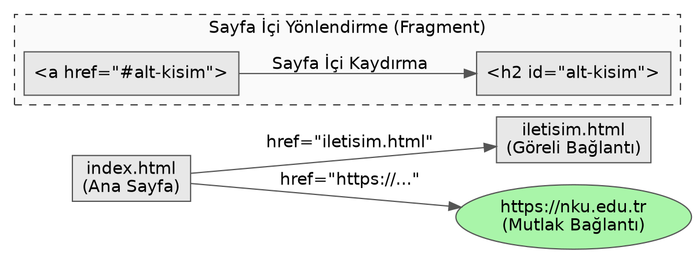

# HTML Bağlantıları: Anchor (Çapa) Etiketi ve Yönlendirme Mantığı

Gençler, HTML'in temelini ve web'i gerçek anlamda birbirine bağlı bir "ağ" (web) haline getiren en önemli yapı taşını inceleyeceğiz. Bir HTML belgesini statik bir metin dosyası olmaktan çıkarıp, onu diğer belgelere, sunuculara veya aynı belgenin farklı bölümlerine bağlayan eleman `<a>` etiketidir.

Buradaki `a` harfi, İngilizce **Anchor** (Çapa) kelimesinin baş harfidir. Kelimenin kökeni Latince *ancora* sözcüğüne dayanır ve denizcilikte gemiyi belirli bir noktaya sabitlemek için denize atılan demir anlamına gelir. Bilgisayar bilimlerinde bu terimin seçilmesi tesadüfi değildir; tıpkı bir geminin bulunduğu noktadan denizin dibindeki bir noktaya fiziksel bir bağ kurması gibi, anchor etiketi de okuduğunuz mevcut metin ile hedefteki diğer bir belge arasında mantıksal bir bağ kurar, oraya "demir atar".

## Temel Kullanım ve `href` Niteliği

Bir çapa etiketinin tek başına bir anlam ifade etmesi mümkün değildir. Nereye demir atacağını tarayıcıya (browser) söylemeniz gerekir. Bu noktada **Hypertext Reference** (Hipermetin Referansı - `href`) niteliği devreye girer. `href`, kullanıcının tıkladığında yönlendirileceği hedef adresi barındırır.

```html
<a href="https://www.nku.edu.tr">Namık Kemal Üniversitesi</a>
```

Yukarıdaki kod parçasında, açılış ve kapanış etiketleri arasındaki metin ("Namık Kemal Üniversitesi"), kullanıcının ekranda göreceği ve tıklayabileceği kısımdır. `href` ise perdenin arkasında çalışan, veri paketlerinin hangi sunucuya veya belgeye yönlendirileceğini belirten referans noktasıdır.

## Adresleme Yöntemleri: Mutlak ve Göreli Referanslar

Bağlantıların hedef noktalarını belirtirken, kaynakların nerede olduğuna bağlı olarak iki farklı adresleme stratejisi kullanılır.

1. **Mutlak Adresleme (Absolute URL - Mutlak Tekdüze Kaynak Bulucu):** Hedef belgenin internet üzerindeki tam ve kesin konumudur. Genellikle dış kaynaklara, farklı alan adlarına (domain) bağlantı verirken kullanılır. Protokol (`http` veya `https`) ile başlamak zorundadır.
   ```html
   <a href="https://www.google.com/search?q=html">Google'da HTML Ara</a>
   ```

2. **Göreli Adresleme (Relative URL - Göreli Tekdüze Kaynak Bulucu):** Bağlantı verilen dosya ile bağlantıyı veren dosya aynı proje veya sunucu dizini (directory) içindeyse kullanılır. Sadece dosyanın konumuna göre bir yol (path) çizilir.
   ```html
   <!-- Aynı klasördeki bir dosyaya bağlantı -->
   <a href="iletisim.html">İletişim Sayfası</a>

   <!-- Bir üst klasöre çıkıp oradaki dosyaya bağlantı -->
   <a href="../hakkimizda.html">Hakkımızda</a>
   ```

## Sayfa İçi Yönlendirmeler (Fragment Identifiers)

Çapa etiketi her zaman farklı bir belgeye gitmek zorunda değildir. Özellikle çok uzun bir metin okuyorsanız, belgenin en üstüne veya belirli bir başlığa doğrudan atlamak isteyebilirsiniz. Bunun için HTML elemanlarının `id` (Kimlik - Identifier) niteliği kullanılır. `href` değerinin başına kare `#` sembolü (hash) konularak belirli bir `id` değerine sahip elemana referans verilir.

```html
<!-- Sayfanın alt kısımlarında bir başlık -->
<h2 id="veri-yapilari">Veri Yapıları Konusu</h2>

<!-- Başka bir noktadan o başlığa yönlendiren bağlantı -->
<a href="#veri-yapilari">Veri Yapıları bölümüne git</a>
```

## Yönlendirme Davranışı ve `target` Niteliği

Kullanıcı bir bağlantıya tıkladığında tarayıcının yeni belgeyi nasıl açacağını `target` (Hedef) niteliği ile kontrol ederiz. Varsayılan (default) davranış `_self` değeridir; yani sayfa mevcut sekmede açılır. Ancak kullanıcıyı mevcut sayfadan koparmamak için bağlantının yeni bir sekmede açılması istenebilir. Bunun için `_blank` değeri kullanılır.

```html
<a href="belge.pdf" target="_blank">Ders Notunu İndir</a>
```

Bu noktada web güvenliği (web security) açısından önemli bir ayrıntıya değinmemiz gerekir. Bir bağlantıyı `target="_blank"` ile yeni bir sekmede açtığınızda, açılan yeni sayfa, kendisini açan kaynak sayfanın tarayıcı nesne modeline (Document Object Model - DOM) ait belirli özelliklere erişebilir. Özellikle JavaScript tarafındaki `window.opener` nesnesi aracılığıyla, yeni açılan kötü niyetli bir sayfa, kaynak sayfanın adresini değiştirerek kullanıcıyı sahte bir giriş ekranına yönlendirebilir. Bu güvenlik zafiyetine literatürde **Tabnabbing** (Sekme avlama) denir.

Bu riski ortadan kaldırmak için, kullanıcıdan bağımsız dış bağlantılara `target="_blank"` eklendiğinde, `rel` (Relationship - İlişki) niteliğine mutlaka `noopener` ve `noreferrer` değerleri eklenmelidir. Bu işlem, açılan yeni sayfanın kaynak sayfa ile olan bağını (`window.opener` erişimini) tamamen keser.

```html
<a href="https://guvenilmeyen-site.com" target="_blank" rel="noopener noreferrer">Dış Bağlantı</a>
```

## Farklı Protokollerin Kullanımı

Çapa etiketinin `href` niteliği yalnızca web sayfalarına (`http://` veya `https://`) değil, işletim sisteminin diğer varsayılan uygulamalarına da tetikleyici komutlar gönderebilir. 

- **E-posta İstemcisi:** `mailto:` protokolü kullanıldığında, kullanıcının bilgisayarındaki veya telefonundaki varsayılan e-posta uygulaması, belirtilen adrese yeni bir e-posta gönderecek şekilde açılır.
- **Telefon Araması:** `tel:` protokolü, özellikle mobil tarayıcılarda doğrudan arama ekranını tetikler.

```html
<a href="mailto:ornek@nku.edu.tr">E-posta Gönder</a>
<a href="tel:+902822502300">Fakülteyi Ara</a>
```

## Bağlantı Akış Mimarisi

Bağlantıların bir belgeden diğerine ve belge içindeki farklı noktalara olan yönlendirme mantığını aşağıdaki yönlendirme grafiğinde yapısal olarak inceleyebiliriz:



Özetlemek gerekirse, `<a>` etiketi basit bir metin işaretleme işleminden ibaret değildir. Hedefin konumuna göre mutlak veya göreli adreslemeyi kullanmayı, sayfa içi yönlendirmelerle kullanıcı deneyimini artırmayı ve yeni sekme açarken oluşabilecek güvenlik açıklarını `rel="noopener noreferrer"` ile kapatmayı öğrenmek, güvenli ve bütünleşik bir web mimarisi kurmanın temel şartıdır.