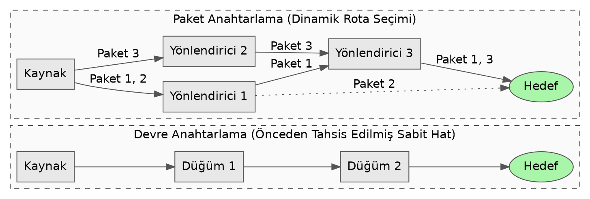

# **İletişim Ağlarının Temelleri: Veri Paylaşımının Mantığı, Galaktik Ağ ve Tarihsel Gelişim**

Bilgisayar ağları ve veri iletişimi, günümüz medeniyetinin sinir sistemini oluşturan en temel yapılardan biridir. Önümüzdeki süre boyunca, modern bilişim altyapılarının nasıl inşa edildiğini, yalıtılmış halde çalışan makinelerin birbirleriyle nasıl etkileşime geçtiğini ve bu devasa yapının tarihsel süreçte hangi felsefi temeller üzerine oturtulduğunu en ince ayrıntısına kadar inceleyeceğiz. Konuyu, en temel yapı taşlarından başlatarak, karmaşık ağ protokollerinin derinliklerine doğru kademeli ve sistematik bir şekilde ele alacağız.

İletişim ağlarının mantığını kavrayabilmek için, öncelikle kullandığımız cihazların ve işlediğimiz temel materyalin ne olduğunu net bir biçimde tanımlamamız gerekir. Bilgisayar, en yalın tanımıyla, kullanıcılardan aldığı verilerle aritmetik ve mantıksal işlemleri yapabilen, yaptığı işlemlerin sonuçlarını saklayabilen ve istendiğinde bu bilgilere ulaşılmasını sağlayan elektronik bir makinedir. Uzun ve karmaşık hesaplamaları büyük bir hızla yapabilen, mantıksal bağlantılara dayalı karar verip işlem yürüten bu cihazlar, milattan önce sayma işlemine yarayan abaküs ile başlayan tarihsel serüvenini, 1800'lü yıllarda hesap makinelerinin geliştirilmesiyle sürdürmüştür. 1945'lerde daha çok askeri amaçlarla geliştirilen bu sistemler, 1970'lerden itibaren hafıza kapasitelerinin ve işlem hızlarının artmasıyla hayatın vazgeçilmez bir parçası haline gelmiştir. Ancak tek başına duran bir bilgisayarın işleme kapasitesi, yalnızca kendi donanımının sınırlarıyla çerçevelenmiştir. Bilgisayarın gerçek potansiyeli, hesaplama yeteneğinde değil, ürettiği sonuçları diğer bilgisayarlarla paylaşabilme kabiliyetinde yatar.

Bilgisayarların işlediği ve paylaştığı bu temel yapı taşına "Veri" (Data) adını veriyoruz. Veri, her türlü bilginin, bilgisayarın işlem yapabileceği, sonuçlar üretebileceği, saklayabileceği ve gerektiğinde yeniden okuyabileceği şekilde sayısal birimlere dönüştürülmüş halidir. Bilişim sistemlerinin varoluş amacı, bu veriyi saklamak, işlemek ve ondan anlamlı sonuçlar çıkarmaktır. Bu kavramın dilsel kökenine inmek, onun doğasını anlamamıza yardımcı olur. Veri kelimesinin İngilizce karşılığı olan *data*, Latincede "vermek" anlamına gelen *dare* fiilinin geçmiş zaman ortacı olan *datum* kelimesinin çoğul formudur. Klasik dönemde, matematiksel problemlerde hesaplamaların temeli olarak "verilen gerçekler" anlamında kullanılmıştır. 1640'lı yıllardan itibaren bu anlamıyla kullanılmaya başlanan kelime, 1897'de gelecekte başvurulmak üzere toplanan sayısal gerçekler olarak genişlemiş, 1946 yılına gelindiğinde ise bilgisayar operasyonlarının gerçekleştirilmesini sağlayan, iletilebilir ve depolanabilir bilgi formunu tam olarak karşılamaya başlamıştır. Dolayısıyla veri, kendi başına durağan bir nesne değil, adının kökeninde de yattığı üzere, işlenmek, dönüştürülmek ve başka bir sisteme "verilmek" üzere var olan bir kaynaktır.

## **Makineler Arası İletişim ve Anlaşma Temelleri**

Yalıtılmış haldeki verinin başka bir sisteme aktarılması süreci "İletişim" (Communication) olarak tanımlanır. İzole bilgisayarların, çeşitli yöntemlerle birbirine bağlanabilir hale gelerek bilgisayar ağlarını oluşturmaya başlaması, bilginin küreselleşmesini ve kendisini daha hızlı üretmesini sağlayan en kritik teknolojik sıçramadır. İletişim kelimesinin kökeni, 14\. yüzyıl Eski Fransızcası üzerinden, doğrudan Latince *communicationem* kelimesine dayanır. Bu kelime, "ortak yapmak, paylaşmak, birleştirmek veya bilgilendirmek" anlamlarına gelen *communicare* fiilinden türemiştir. Bu fiilin merkezinde yer alan *communis* sözcüğü, "ortak, kamuya ait veya genel" anlamlarını taşır ve Proto-Hint-Avrupa dil ailesindeki *ko-moin-i-* (ortaklaşa tutulan) kökünden gelir. Bu etimolojik arka plan tesadüfi değildir; bilgisayarlar bir ağ üzerinde veri paylaştıklarında, tamamen kendi yerel disklerinde yalıtılmış olan o sayısal veriyi ağdaki diğer sistemlerle ortaklaştırarak kamuya açık veya paylaşılan bir forma dönüştürürler.

Bu ortaklaştırma eyleminin belirli bir disiplin ve kurallar bütünü içinde gerçekleşmesi şarttır. İki farklı donanım mimarisine, farklı işletim sistemlerine ve farklı işlem kapasitelerine sahip makinenin birbirini anlayabilmesi, ancak ve ancak üzerinde uzlaştıkları standart bir dil ile mümkündür. Bilgisayar ağlarındaki bu standart kurallar bütününe "Protokol" (Protocol) adını veriyoruz. Protokol, iletişim ağındaki verilerin hangi formatta paketleneceğini, hataların nasıl denetleneceğini, eksik verilerin nasıl tamamlanacağını ve iletişimin nasıl sonlandırılacağını en ince ayrıntısına kadar belirleyen katı kurallar dizisidir.

Protokol kelimesinin tarihsel serüveni oldukça dikkat çekicidir. Orta Çağ Latincesinde *protocollum* olarak karşımıza çıkan bu kelimenin asıl kökü, Eski Yunancadaki *prōtokollon* sözcüğüdür. Bu kelime, "ilk" anlamına gelen *prōtos* ile "tutkal veya yapıştırıcı" anlamına gelen *kolla* kelimelerinin birleşmesinden oluşmuştur. Tarihsel olarak bir el yazmasının veya papirüs rulosunun en dışına yapıştırılan, belgenin içeriğini, yazarını ve olası hatalarını özetleyen "ilk sayfa" anlamına geliyordu. Zamanla diplomatik ilişkilerde, devletlerin sorunları barışçıl yollarla çözmek için imzaladıkları resmi kurallar bütününe ve diplomatik nezaket kurallarına dönüşmüştür. Bilgisayar ağlarında da protokollerin görevi tam olarak budur: Verinin kendisi (yani asıl mesaj) aktarılmadan önce, iki makine arasında iletişimin nasıl kurulacağını belirleyen, sistemleri birbirine "yapıştıran" ilk diplomatik kurallar bütününü oluştururlar.

İletişim ağlarındaki bu protokoller genellikle İstemci-Sunucu (Client-Server) mimarisi etrafında şekillenir. Bu yapı, bir istek-yanıt döngüsü üzerine kurgulanmıştır. İstemciler veri veya işlem talebinde bulunan cihazlardır. Öte yandan, sunucular bu talepleri dinleyen, işleyen ve gerekli veriyi istemciye ulaştıran, kesintisiz çalışan yüksek kapasiteli bilgisayarlardır. "Sunucu" (Server) kelimesi bilişim literatürüne 1992 yılı civarında yerleşmiş olsa da, kelimenin kökeni Latincede "hizmet etmek, bağlı olmak veya boyun eğmek" anlamlarına gelen *servire* fiiline dayanır. Sunucular, kelimenin tam anlamıyla ağ üzerindeki istemcilerin taleplerine hizmet etmeye adanmış, bu göreve tahsis edilmiş birimlerdir.

## **Veri Aktarım Mimarisinin Mühendisliği: Devre ve Paket Anahtarlama**

Gençler, iki bilgisayarın bir protokol üzerinde mantıksal olarak anlaşması, işin sadece yazılım boyutudur. Bilgisayarlar arasında üretilen bu sayısal verinin fiziksel kablolar, fiber optik hatlar ve yönlendiriciler üzerinden diğer tarafa nasıl kayıpsız bir şekilde ulaştırılacağı, ağ mühendisliğinin en çetin sorunlarından birini oluşturmuştur. Bilgisayar verilerinin bir cihazdan veya ağdan diğerine, belirli donanımlar aracılığıyla aktarılması süreci "Anahtarlama" (Switching) olarak adlandırılır. İletişim teknolojileri tarihinde ve günümüz mimarisinde bu sorunu çözmek için geliştirilmiş iki ana yöntem bulunmaktadır: Devre Anahtarlama (Circuit Switching) ve Paket Anahtarlama (Packet Switching).

### **Devre Anahtarlama Mimarisi**

Devre anahtarlama, telekomünikasyon tarihinin en eski ve geleneksel yöntemidir. Temelde, veri iletimi başlamadan önce gönderici ve alıcı arasında fiziksel veya mantıksal olarak tahsis edilmiş, özel bir iletişim yolunun (devrenin) kurulması esasına dayanır. İletişim üç net evreden oluşur: Öncelikle iki nokta arasında bir bağlantı kurulur ve bu yol ayrılır; ardından veri transferi gerçekleştirilir; iletişim bittiğinde ise bağlantı sonlandırılarak kaynaklar serbest bırakılır.

Bu mimarinin en büyük avantajı, kurulan yolun bant genişliğinin (bandwidth) iletişim süresi boyunca yüzde yüz garanti altında olmasıdır. Kaynaklar önceden tamamen o iletişime ayrıldığı için, ağda ne kadar yoğunluk olursa olsun, o iki nokta arasındaki veri akışında dalgalanma olmaz. Performans son derece tahmin edilebilirdir ve sinyal gecikmesi (latency) minimum düzeydedir. Bu durum, sürekli ve kesintisiz akış gerektiren gerçek zamanlı ses veya video iletişimleri için ideal bir ortam sağlar.

Ancak devre anahtarlama mimarisi, doğası gereği kesintili (bursty) yapıya sahip olan bilgisayar verileri için son derece verimsizdir. Bir dosya indirirken veya bir e-posta gönderirken, veriler sürekli bir akış halinde değil, belirli anlarda yoğunlaşan kümeler halinde iletilir. İki bilgisayar arasındaki iletişim sırasında veri gönderimi anlık olarak dursa dahi, devre anahtarlama mantığında o hat başka hiçbir cihaz tarafından kullanılamaz. Bu durum, devasa boyutlardaki ağ kaynaklarının israf edilmesine yol açar. Kaynakların bu şekilde özel olarak tahsis edilmesi sistemi maliyetli hale getirir ve fiziksel hat sayısı sınırlı olduğu için ağın büyüme kapasitesini, yani ölçeklenebilirliğini kısıtlar. Bu teknoloji ağırlıklı olarak fiziksel katmanda (physical layer) çalışır ve veri işleme işlemi ağ üzerindeki ara düğümlerde değil, yalnızca kaynak sistemlerde gerçekleştirilir. Ayrıca iletişim yolundaki herhangi bir fiziksel kopukluk, o hattın tamamen işlevsiz kalmasına ve bağlantının anında kesilmesine neden olur.

### **Paket Anahtarlama Mimarisi**

Bilgisayar ağlarının küresel bir boyuta ulaşmasını ve günümüz internetinin var olmasını sağlayan asıl teknolojik devrim, Paket Anahtarlama yöntemidir. Bu yöntemde, iletilecek bütünsel dosya veya mesaj tek parça halinde gönderilmez; bunun yerine "paket" (packet) adı verilen daha küçük, standardize edilmiş ve kolay yönetilebilir veri birimlerine bölünür.

"Paket" kelimesinin etimolojik serüveni, kavramı zihnimizde daha iyi canlandırmamıza olanak tanır. Kelime, 15\. yüzyılın ortalarında İngilizceye giren ve Orta İngilizcede "büyük bohça veya bağ" anlamına gelen *pak* kelimesine dayanır. Bu kelimenin sonuna, Vulgar Latincedeki *\-ittum* veya *\-itta* eklerinden türeyerek Eski Fransızca üzerinden İngilizceye geçen ve "küçültme" ifade eden *\-et* eki getirilmiştir. Yani paket, kelime anlamı olarak tam karşılığıyla "küçük bohça" demektir. Büyük bir veriyi, taşıması zor tek bir kargo yerine, her birinin üzerinde adresi yazan binlerce küçük kargo kutusuna dönüştürme işlemi bu mimarinin temelidir.

Paket anahtarlamalı ağlarda, her bir paketin içine sadece taşınan asıl veri (payload) konulmaz; aynı zamanda kaynağın IP adresi, hedefin IP adresi, verinin tekrar birleştirilebilmesi için sıra numarası ve hatalara karşı kontrol bitleri gibi yönlendirme bilgileri de eklenir. Devre anahtarlamanın aksine, kaynak makine ile hedef makine arasında önceden rezerve edilmiş sabit bir yol bulunmaz. Bant genişliği tüm kullanıcılar tarafından ortaklaşa paylaşılır ve ağ kaynakları yalnızca verinin hattan geçtiği o anlık ihtiyaç süresince tahsis edilir.

Bu yapı, ağ altyapısını son derece esnek, verimli ve ölçeklenebilir hale getirir. Bir dosya binlerce pakete bölündüğünde, her bir paket hedefe ulaşmak için o anki ağ yoğunluğuna göre tamamen farklı rotaları izleyebilir. Bu paketler hedefe farklı sıralarla varabilir ve ağın ucundaki protokoller bu paketleri yeniden orijinal sırasına dizmekle yükümlüdür. Devre anahtarlamada doğrudan bir iletim varken, paket anahtarlama "Sakla ve İlet" (Store and Forward) adı verilen temel bir prensiple çalışır. Paket, ağ üzerindeki bir kavşak noktasına gelir, o noktanın hafızasına geçici olarak yazılır, hedefe giden en uygun yol hesaplanır ve ardından bir sonraki kavşak noktasına iletilir.

Bu kavşak noktalarında görev yapan, veriyi işleyen ve rotasını belirleyen cihazlara Yönlendirici (Router) diyoruz. "Yönlendirmek" veya "Rota" (Route) kavramı, Hint-Avrupa dil ailesindeki *wrod-* (kazmak, eşelemek veya kökünden sökmek) kökünden gelir. Kelimenin Fransızca üzerinden İngilizceye geçen formunun temelinde ise Vulgar Latincedeki *rupta* kelimesi yatar. *Rupta*, Latincede "dağılmış, parçalanmış, kırılmış grup" anlamına gelir. Yönlendiriciler, tıpkı kelimenin kökeninde olduğu gibi, parçalanmış paket yığınlarının karmaşık ve adeta kırık dökük ağ topolojisi içinden eşelenerek, hedefe varacak en optimal patikayı bulmasını sağlayan zeki cihazlardır. Bu işlem, ağın donanım seviyesinin hemen üstünde, veri bağlantı katmanı (datalink layer) ve ağ katmanında (network layer) gerçekleştirilir ve iletim sırasında karşılaşılan karmaşık protokolleri kullanır.

Bu iki temel veri iletim mimarisinin işleyiş farklarını aşağıdaki yönlendirme grafiğinde inceleyebiliriz:

### Veri İletim Yöntemleri Karşılaştırması

Mimari düzeydeki bu iki yaklaşımın karakteristik özelliklerini ve ağ yönetimine olan etkilerini bir tablo üzerinden yapısal olarak kıyaslamak konunun pekiştirilmesini sağlayacaktır:

| Kriter | Devre Anahtarlama (Circuit Switching) | Paket Anahtarlama (Packet Switching) |
| :---- | :---- | :---- |
| **Yol ve Rota Seçimi** | İletişim başlamadan önce sabit bir fiziksel veya mantıksal yol belirlenir. | Her bir paket hedefini kendi bilir, yönlendiriciler anlık duruma göre rotayı dinamik olarak belirler. |
| **Bant Genişliği** | Tamamen tek bir bağlantı için rezerve edilir ve sabittir. | Rezervasyon yoktur, tüm kullanıcılar mevcut bant genişliğini ortak kullanır. |
| **İletim Prensibi** | Doğrudan uçtan uca iletim söz konusudur. | "Sakla ve İlet" (Store and Forward) prensibiyle, her düğümde paket geçici hafızaya alınır. |
| **Veri İşleme Noktası** | Yalnızca kaynak ve hedef sistemlerde işlenir. | Ara düğümlerdeki yönlendiricilerde (kavşaklarda) yönlendirme amacıyla sürekli işlenir. |
| **Dayanıklılık** | Hat üzerinde oluşacak tek bir kopukluk tüm iletişimi keser; daha az güvenilirdir. | Hat kopsa bile yönlendiriciler alternatif rotalar bulur; çok daha esnek ve dayanıklıdır. |
| **Tıkanıklık Evresi** | Bağlantı isteği anında hat doluysa reddedilir (bağlantı evresinde tıkanıklık). | Veri transferi sırasında yönlendirici hafızalarının dolmasıyla anlık paket kayıpları yaşanabilir. |
| **Kullanım Alanı** | Geleneksel telefon hatları, eşzamanlı ses iletimi. | Bilgisayar ağları, internet protokolleri, e-posta, web gezintisi. |

İki bilgisayarın veri paylaşımında paket anahtarlamayı seçmiş olmasının arka planında, bir hattın kopmasına rağmen iletişimin alternatif yollardan hayatta kalabilmesi fikri yatar. Bu mimari tercih, iletişim ağlarının yalnızca teknolojik değil, aynı zamanda stratejik bir şekilde kurgulandığının en açık göstergesidir.

## **Vizyonun Adı: Galaktik Ağ**

Gençler, bilgisayar bilimleri sadece devrelerin ve kodların birleşimi değil, aynı zamanda o devrelerin ne amaçla kullanılacağını hayal eden zihinlerin ürünüdür. İnternet dediğimiz yapı, bir laboratuvarda tesadüfen bulunmuş bir formül değildir. Yıllar süren akademik tartışmaların, stratejik savunma yatırımlarının ve insan makine etkileşimini yeniden tanımlayan vizyonların uzun bir sonucudur. İletişim ağları tarihine yön veren bu vizyonun mimarlarından ilki, ismi kamuoyunda çok bilinmese de bilişim tarihinin en kilit figürlerinden biri olan Joseph Carl Robnett Licklider'dır.

Licklider'ın düşüncelerinin değerini anlayabilmek için, 1960'ların başındaki bilişim dünyasının durumunu göz önünde bulundurmalıyız. O dönemde bilgisayarlar devasa salonları kaplayan, pahalı, işlem süreleri çok uzun olan ve genellikle sadece askeri kurumların veya büyük üniversitelerin erişebildiği izole cihazlardı. İnsan ile makine arasındaki etkileşim, yığın işlem (batch processing) adı verilen ve sonuçların saatler hatta günler sonra alınabildiği bir yöntemle yapılıyordu. MIT'de (Massachusetts Institute of Technology) psiko-akustik alanında çalışmalar yürüten Licklider, bilgisayarların sadece gelişmiş hesap makineleri olarak kalmaması gerektiğine inanıyordu. Onun vizyonunda bilgisayarlar, insanın düşünme kapasitesini artıran, insanla etkileşimli çalışan entelektüel ortaklardı.

Ağustos 1962'de Licklider, Massachusetts Teknoloji Enstitüsü'nden çalışma arkadaşlarına yazdığı bir dizi not (memorandum) ile "Galaktik Ağ" (Galactic Network) adını verdiği devrimsel kavramı tartışmaya açtı. Licklider'ın Galaktik Ağ vizyonu, dünyanın herhangi bir yerindeki bir insanın, herhangi bir bilgisayar terminalini kullanarak farklı coğrafyalardaki veri ve programlara anında ve hızlı bir şekilde erişebileceği, küresel ölçekte birbirine bağlı bir sistem hayaliydi. Bu fikir, sadece donanımsal bir ağ altyapısını değil, bilgisayarlar aracılığıyla insanların fiziksel mekan sınırlarından bağımsız olarak bilgi alışverişinde bulunabilecekleri, işbirliği yapabilecekleri sosyal bir etkileşim ortamını da tanımlıyordu. Yapısal ve işlevsel olarak değerlendirildiğinde Licklider, bugünkü internetin ve hatta verilerin merkezi sunucularda tutularak uzaktan erişildiği bulut bilişim (cloud computing) mimarisinin felsefi temelini o günlerde neredeyse birebir kurgulamıştı.

Çalışmalarını derinleştiren Licklider, Nisan 1963'te meslektaşlarına ve ekibine daha spesifik bir not gönderdi. Bu memorandumu dikkat çekici bir başlıkla, "İntergalaktik Bilgisayar Ağı Üyeleri ve İştirakçilerine" (Memorandum for Members and Affiliates of the Intergalactic Computer Network) başlığıyla yayınladı. Bu yazıda Licklider, o dönemin ilkel yazılımlarını kullanarak bilgisayarlar arasında zaman paylaşımlı (time-sharing) devasa bir ağ kurmanın teknik zorluklarına ve olası çözümlerine değiniyordu. Zaman paylaşımı, çok pahalı ve nadir olan bilgisayar işlemci gücünün, aynı anda birden fazla kullanıcı terminali arasında, adeta her kullanıcı sistemi tek başına kullanıyormuş hissi verecek şekilde paylaştırılması prensibidir. Bu konsept, bilgisayarların verimli kullanımı için ağlar kurmanın kaçınılmaz olduğunu akademik çevreye kanıtladı.

Ekim 1962'de Licklider, bu teorilerini devlet destekli bir projeye dönüştürme fırsatı buldu ve ABD Savunma Bakanlığı İleri Araştırma Projeleri Ajansı (ARPA \- günümüzde DARPA olarak bilinir) bünyesinde kurulan Bilgi İşleme Teknikleri Ofisi'nin (IPTO) ilk başkanı olarak atandı. ARPA'daki yöneticilik döneminde bizzat ağ kurma çalışmalarını tamamlayamamış ve 1964 yılında kurumdan ayrılmış olsa da, "ağ oluşturma" fikrini kurumun DNA'sına başarıyla işledi. Otonom makinelerin ağ üzerinden ortak veri kullanabileceği vizyonu, kendisinden sonra görevi devralan Ivan Sutherland, Bob Taylor ve Lawrence G. Roberts gibi öncü bilim insanlarını derinden etkiledi ve onları bu ağı inşa etmekle görevlendirdi. Böylelikle Licklider'ın Galaktik Ağ hayali, sadece birkaç yıl sonra ARPANET projesine dönüşerek modern internetin tohumlarını attı.

## **Teoriden Pratiğe: ARPANET'in Doğuşu ve Ağların Birleşmesi**

Bu akademik vizyonların laboratuvar ortamından çıkarak milyarlarca dolarlık fiziksel projelere dönüşmesi, Soğuk Savaş yıllarının getirdiği yoğun politik ve askeri baskıların bir sonucudur. İletişim sistemlerinin evrimindeki temel kırılma noktalarından biri 1957 yılında yaşandı. Sovyetler Birliği'nin Sputnik 1 uydusunu başarıyla yörüngeye yerleştirmesi, Amerika Birleşik Devletleri için sadece bir uzay yarışı mağlubiyeti değil, aynı zamanda teknolojik üstünlüğün kaybedilmesi endişesini beraberinde getirdi.

Bu endişe karşısında ABD hükümeti 1958 yılında, askeri projeleri, iletişim araştırmalarını ve ileri teknoloji çalışmalarını fonlamak üzere Savunma Bakanlığı bünyesinde Gelişmiş Savunma Araştırma Projeleri Ajansı'nı (ARPA) kurdu. Olası bir nükleer savaş, siber saldırı veya büyük çaplı bir altyapı çöküşü durumunda, geleneksel devre anahtarlamalı iletişim hatlarının tamamen kesileceği açıktı. Çünkü merkezi bir yapıya sahip olan bu sistemlerde ana düğümlerden biri yok edildiğinde tüm iletişim duruyordu. ARPA, merkezden bağımsız, dağınık bir yapıya sahip ve bazı düğümleri yok edilse dahi geri kalan düğümler üzerinden bilginin alternatif yollarla hedefe ulaştırılabileceği bir yapı inşa etme kararı aldı.

Tam bu arayış sırasında, RAND Corporation'da askeri araştırmalar yapan Paul Baran 1960'ların başında, verilerin "mesaj blokları" (yani veri paketleri) halinde bölünerek dağıtık bir ağ üzerinden iletilmesi fikrini ortaya attı. Bu sisteminin amacı nükleer bir savaşta dahi iletişimin hayatta kalabilmesini (survivable network) sağlamaktı. Eş zamanlı olarak İngiltere Ulusal Fizik Laboratuvarı'nda (NPL) Donald Davies de birbirinden habersiz olarak aynı teoriyi geliştirdi ve bu yönteme ticari kullanıma da uygun olacak şekilde "paket anahtarlama" (packet switching) adını vererek literatüre kazandırdı.

Bu güçlü akademik teorilerin üzerine 1969 yılında, Lawrence Roberts'ın yönetiminde ARPANET (Advanced Research Projects Agency Network) projesi fiilen başlatıldı. ARPANET'in fiziksel kurulumunda kullanılan donanımlar, yani farklı bilgisayarların birbirine bağlanmasını sağlayan bugünkü yönlendiricilerin atası konumundaki Arayüz Mesaj İşlemcileri (Interface Message Processors \- IMPs), Bolt, Beranek ve Newman (BBN) şirketi tarafından inşa edildi ve donanım tasarımı Bob Kahn tarafından yönetildi.

Ağ altyapısının hazırlanmasının ardından, bilgisayar ağları tarihi için devrim niteliğinde olan o ilk veri paylaşım testi, 29 Ekim 1969 tarihinde gerçekleştirildi. Proje kapsamında Los Angeles'taki Kaliforniya Üniversitesi (UCLA) ile Stanford Araştırma Enstitüsü (SRI) arasında yüzlerce kilometrelik bir mesafeden ilk mesaj gönderimi denendi. Araştırmacılar, karşıdaki bilgisayara bağlanmak için klavyeden "LOGIN" (giriş yap) kelimesini göndermeyi planlamışlardı. Ancak teknolojik imkanların henüz sınırlarında dolaşılan o günlerde, sistem "L" ve "O" harflerini karşı tarafa başarıyla ilettikten hemen sonra bellek yetersizliğinden dolayı çöktü. Böylelikle, insanlığın makineler aracılığıyla kurduğu o ilk global iletişimin ilk kelimesi "LO" olarak tarih kayıtlarına geçmiş oldu. Kısa süre sonra sistem onarıldı ve mesajın tamamı gönderilerek ağın çalıştığı kanıtlandı.

### **İletişimin Evrensel Dili: TCP/IP Devrimi**

ARPANET başlangıçta görevini başarıyla yerine getiriyordu, ancak sistem veri iletiminde Ağ Kontrol Programı (Network Control Program \- NCP) adı verilen oldukça yerel ve sınırlı bir protokol kullanıyordu. NCP'nin en büyük sorunu, yalnızca ARPANET'in kendi içindeki belirli donanımların birbirleriyle konuşmasına imkan tanımasıydı. ARPANET genişledikçe, farklı kurumların kendi kurdukları farklı mimarideki bilgisayar ağları bu sisteme dahil olmak istiyor, fakat her bir ağın donanımı farklı olduğu için birbirleriyle veri alışverişi yapamıyorlardı.

1973 yılına gelindiğinde, araştırmacılar Vint Cerf ve Bob Kahn, bu uyumsuzluk sorununu ortadan kaldırmak için "internetworking" (ağların birbirine bağlanması) üzerine çalışmaya başladılar. Amaçları, dünyadaki tüm farklı ağları tek bir yapı altında toplayacak olan o "ağların ağını" (network of networks) oluşturmaktı. Bunun için sistemlerin altındaki fiziksel donanım farklılıklarını tamamen gizleyecek, bilgisayarların iletişim güvenilirliğini ağ altyapısından alıp uç noktalardaki host bilgisayarlara yükleyecek evrensel bir mantık geliştirdiler. 1974 yılında yayınladıkları makale ile İletim Kontrol Protokolü / İnternet Protokolü (Transmission Control Protocol / Internet Protocol \- TCP/IP) mimarisini bilim dünyasına tanıttılar.

TCP/IP mimarisi, farklı görevleri olan iki temel katmandan oluşur. Bu görevleri net olarak ayırmak, veri aktarım mantığını anlamamız açısından son derece önemlidir:

* **İletim Kontrol Protokolü (TCP):** Paket anahtarlamalı ağlarda paketlerin farklı yollardan seyahat ettiğini, bazılarının kaybolabileceğini veya gecikebileceğini belirtmiştik. TCP, bu kaosun içinde düzeni sağlayan protokoldür. Gönderilecek veriyi paketlere böler, hata kontrolünü yapar, eksik ulaşan paketlerin tekrar gönderilmesini talep eder ve alıcı tarafta karmaşık sırayla gelen paketleri orijinal haline uygun olarak birleştirir.  
* **İnternet Protokolü (IP):** IP'nin tek bir görevi vardır; o da veri paketlerinin doğru hedefe yönlendirilmesini ve bilgisayara ulaşmasını sağlamaktır. İletişim ağındaki her cihazın tespit edilebilmesi için IP Adresi adı verilen sayısal kimlikler kullanılır. 1970'lerde oluşturulan ilk yaygın mimari olan IPv4 (Internet Protocol version 4), 32-bitlik bir sisteme dayanıyordu ve yaklaşık 4,3 milyar cihaza benzersiz adres sağlıyordu. Ancak ağın küresel çapta öngörülemeyen büyümesi sebebiyle adres kapasitesi tükendiğinden, 128-bitlik bir numaralandırma kullanan ve 340 undesilyon gibi astronomik bir adres havuzu sunan IPv6 protokolü devreye alınmıştır.

İnternet tarihçesinde 1 Ocak 1983, çok kritik bir dönüm noktasıdır. Bilişim dünyasında "Bayrak Günü" (Flag Day) olarak da bilinen bu tarihte, ARPANET bünyesinde eski NCP kullanımı tamamen durdurulmuş ve tüm altyapı resmi olarak TCP/IP protokolüne geçiş yapmıştır. TCP/IP'nin sivil ve ticari kullanıma uygun standartları sağlamasıyla, bağımsız ağlar birbirine bağlanmaya başlamış, 1980'li yıllarda İngiltere ve Japonya gibi ülkelerdeki farklı ağlar ARPANET ile başarılı bir şekilde iletişime geçmiştir. Bu nedenle 1 Ocak 1983, farklı yapıların evrensel bir standartla ilk kez küresel bir ağ oluşturduğu modern internetin resmi doğum günü olarak kabul edilmektedir.

TCP/IP protokolüne geçişle birlikte bilgisayarlar sayısal IP adresleri üzerinden haberleşmeye başlamıştır. Ancak insanların 192.0.2.1 gibi sayı dizilerini akılda tutması pratik değildir. Bu kullanıcı deneyimi sorununu çözmek için 1983 yılında Paul Mockapetris tarafından Alan Adı Sistemi (Domain Name System \- DNS) icat edildi. DNS, insanların kolayca okuyabildiği ve hatırlayabildiği adresleri (örneğin google.com), o sitenin barındığı sunucunun sayısal IP adresleriyle eşleştiren, internetin devasa telefon fihristi olarak çalışan sistemdir.

## **İnternetin Görselleşmesi ve Web'in (WWW) Doğuşu**

1980'lerin sonlarına gelindiğinde internet altyapısı genişlemiş, kıtalar arası kablolar döşenmişti. Akademisyenler ve askeri birimler veri transferi (FTP) yapıyor, e-posta gönderiyor (ilk e-posta 1971'de Ray Tomlinson tarafından gönderilmiş ve "@" işaretiyle kullanıcı ve makine isimleri ayrılmıştı) ve tartışma gruplarında haberleşiyorlardı. Ancak sistem tamamen metin tabanlı çalışıyordu. Kullanıcıların karmaşık komutlar bilmesi gerekiyordu ve internetin evlerde veya okullarda standart bir kullanıcı tarafından deneyimlenebilmesi mümkün değildi. İnternet sadece siyah ekranlardaki beyaz veya yeşil yazılardan ibaretti.

İnterneti akademinin sınırlarından çıkarıp dünyadaki milyarlarca insanın günlük yaşamına entegre eden devrim, World Wide Web (WWW) yani Dünya Çapında Ağ olmuştur. Bu noktada kavramsal bir hatayı düzeltmekte fayda var: Günlük konuşmalarda "İnternet" ve "Web" kelimeleri sıkça birbirinin yerine kullanılır, ancak teknik açıdan birbirlerinden tamamen farklıdırlar. İnternet, bilgisayarları fiziksel kablolarla, yönlendiricilerle ve TCP/IP gibi protokollerle mantıksal olarak birbirine bağlayan devasa altyapının, yolların ve otoyolların bütünüdür. Web ise, bu devasa internet otoyolu üzerinde çalışan, sayfalar, bağlantılar ve tarayıcılar aracılığıyla içeriğe ulaştığımız özel bir servistir.

1989 yılında İsviçre Cenevre'deki Avrupa Nükleer Araştırma Merkezi'nde (CERN) çalışan İngiliz mühendis Tim Berners-Lee, akademik makalelerin ve bilgilerin sistemler arasında kaybolmasını önlemek için, bu bilgilerin "hipermetin" (hypertext) mantığıyla birbirine linklenerek bağlanabileceği bir ağ sistemi önerdi. Berners-Lee'nin icat ettiği World Wide Web, günümüzde de kullandığımız üç temel sac ayağı üzerine inşa edilmiştir:

1. **Hipermetin İşaretleme Dili (Hypertext Markup Language \- HTML):** Bilgisayarlar arasında aktarılan ham verinin, içeriğin yapısını, düzenini ve karşı tarafın ekranında (tarayıcıda) görsel olarak nasıl oluşturulacağını belirleyen standart işaretleme dilidir.  
2. **Hipermetin Transfer Protokolü (Hypertext Transfer Protocol \- HTTP):** İstemci konumundaki web tarayıcısı ile veriyi barındıran sunucu arasındaki veri alışverişi kurallarını belirleyen özel aktarım protokolüdür. Web belgelerinin çağrılmasını sağlayan temel iletişim kuralıdır.  
3. **Tekdüze Kaynak Bulucu (Uniform Resource Locator \- URL):** İnternet okyanusundaki bir kaynağın benzersiz adresini ve o kaynağa erişmek için hangi protokolün (HTTP, FTP vb.) kullanılacağını tam olarak tanımlayan adlandırma sistemidir.

1991 yılında CERN'in ilk web sitesini yayına almasıyla sistem çalışır hale gelmiş ve internet yavaş yavaş ticari kullanıma açılmaya başlamıştır. Ancak asıl kitleselleşme 1993 yılında yaşanmıştır. Amerika'daki Ulusal Süperbilgisayar Uygulamaları Merkezi (NCSA), sadece metinleri değil, görselleri de aynı sayfa içerisinde bir düzen halinde gösterebilen, kullanımı son derece kolay olan ilk yaygın grafik arayüzlü web tarayıcısı Mosaic'i geliştirmiştir. Mosaic'in ortaya çıkışı, teknik bilgiye sahip olmayan sıradan insanların da web sitelerinde sörf yapabilmesinin önünü açmış, bilginin küreselleşmesinde yeni bir çağ başlatmıştır. Tüm bu web teknolojilerinin standartları ve gelişimi ise, yine Tim Berners-Lee tarafından kurulan Dünya Çapında Ağ Konsorsiyumu (World Wide Web Consortium \- W3C) adlı organizasyon tarafından yönetilmekte ve denetlenmektedir.

Toparlamak gerekirse, son üç saatlik dilimde bilgisayar ağlarının nasıl yapılandığını yüzeysel bir teknik bakıştan ziyade, bir felsefe ve mimari evrim silsilesi içinde ele aldık. Bilginin yalıtılmışlığından kurtularak ortak bir değere (*communicare*) dönüşme arzusunu, bu arzuyu yöneten protokollerin doğuşunu inceledik. İletişimi kopmaz bir hat zanneden devre anahtarlama mimarisinden, devasa verileri yönetilebilir paketlere bölen, yönlendiriciler aracılığıyla alternatif patikalar bularak ağı yıkılmaz hale getiren paket anahtarlamaya geçişin teknik anatomisini deşifre ettik. Licklider'ın 1960'larda kaleme aldığı notların sadece bir vizyon olmadığını, o notların ARPANET gibi askeri projelerle somutlaşıp, TCP/IP protokolleriyle tüm dünyaya yayıldığını, nihayetinde Tim Berners-Lee'nin Web icadıyla da ekranlarımıza görsel bir evren olarak yansıdığını açıkça gördük. Öğrendiğimiz tüm bu mimari temeller, ilerleyen aşamalarda kodlayacağımız web sistemlerinin, kuracağımız veritabanı bağlantılarının ve geliştireceğimiz uygulamaların altındaki o görünmez motoru oluşturmaktadır.

### **Alıntılanan çalışmalar**

1. BILISIM\_HUKUKU.pdf, [https://drive.google.com/open?id=1BUVDHM7hOnCh3NYuXoaswQukeUYiXAFi](https://drive.google.com/open?id=1BUVDHM7hOnCh3NYuXoaswQukeUYiXAFi)  
2. Data \- Etymology, Origin & Meaning \- Online Etymology Dictionary, erişim tarihi Şubat 11, 2026, [https://www.etymonline.com/word/data](https://www.etymonline.com/word/data)  
3. Communication \- Etymology, Origin & Meaning, erişim tarihi Şubat 11, 2026, [https://www.etymonline.com/word/communication](https://www.etymonline.com/word/communication)  
4. Evolution of the Internet and Web Development Fundamentals  
5. Protocol \- Etymology, Origin & Meaning \- Online Etymology Dictionary, erişim tarihi Şubat 11, 2026, [https://www.etymonline.com/word/protocol](https://www.etymonline.com/word/protocol)  
6. WebveInternetv20-6-7.pdf, [https://drive.google.com/open?id=1MVSZ57MWxpfHiN0nnPDWNTFP\_-QodXOZ](https://drive.google.com/open?id=1MVSZ57MWxpfHiN0nnPDWNTFP_-QodXOZ)  
7. Server \- Etymology, Origin & Meaning \- Online Etymology Dictionary, erişim tarihi Şubat 11, 2026, [https://www.etymonline.com/word/server](https://www.etymonline.com/word/server)  
8. Difference between Circuit Switching and Packet Switching ..., erişim tarihi Şubat 11, 2026, [https://www.geeksforgeeks.org/difference-between-circuit-switching-and-packet-switching/](https://www.geeksforgeeks.org/difference-between-circuit-switching-and-packet-switching/)  
9. History of the Internet \- Wikipedia, erişim tarihi Şubat 11, 2026, [https://en.wikipedia.org/wiki/History\_of\_the\_Internet](https://en.wikipedia.org/wiki/History\_of\_the\_Internet)  
10. Packet \- Etymology, Origin & Meaning \- Online Etymology Dictionary, erişim tarihi Şubat 11, 2026, [https://www.etymonline.com/word/packet](https://www.etymonline.com/word/packet)  
11. How Internet Infrastructure Works | HowStuffWorks, erişim tarihi Şubat 11, 2026, [https://computer.howstuffworks.com/internet/basics/internet-infrastructure.htm](https://computer.howstuffworks.com/internet/basics/internet-infrastructure.htm)  
12. Router \- Etymology, Origin & Meaning \- Online Etymology Dictionary, erişim tarihi Şubat 11, 2026, [https://www.etymonline.com/word/router](https://www.etymonline.com/word/router)  
13. J. C. R. Licklider \- Wikipedia, erişim tarihi Şubat 11, 2026, [https://en.wikipedia.org/wiki/J.\_C.\_R.\_Licklider](https://en.wikipedia.org/wiki/J._C._R._Licklider)