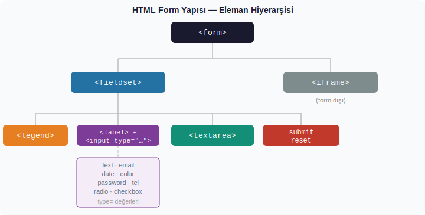
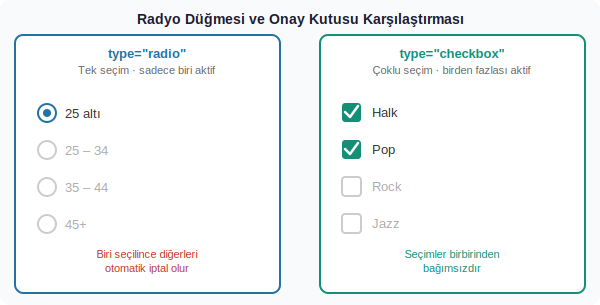

# 4. Uygulama: HTML Formları, Seçim Bileşenleri ve Video

Web'in ilk dönemlerinde sayfalar yalnızca bilgi sunar, kullanıcı ise okurdu. Kullanıcının veri gönderebilmesi — bir kullanıcı adı yazması, bir tercih seçmesi, bir dosya yüklemesi — ancak form (İng. *form*, Lat. *forma*: biçim, kalıp) yapısıyla mümkün oldu. Bugün giriş ekranlarından sipariş formlarına, anketlerden yorum kutularına kadar her etkileşimli bileşenin arkasında bir HTML formu yatar.

Bu uygulamada hem temel form elemanlarını hem de radyo düğmeleri, onay kutuları ve HTML5 ile standart hale gelen `<video>` elemanını inceleyeceğiz.

---

## 1. `<form>` Etiketi

`<form>` etiketi, kullanıcıdan veri toplamak amacıyla bir grup giriş elemanını sarar; bu verilerin nereye ve nasıl gönderileceğini tanımlar.

```html
<form action="/mailinglist.php" method="post">
  ...
</form>
```

Bir zarfın üzerindeki adres ve "iadeli taahhütlü" damgası gibi: `action` nereye gideceğini, `method` ise nasıl taşınacağını söyler.

### `action`

Formun gönderildiği anda verinin iletileceği URL'yi (Uniform Resource Locator — Tekdüzen Kaynak Bulucu) belirtir. Bu adres genellikle sunucu taraflı bir betik (script) dosyasına ya da bir API (Application Programming Interface — Uygulama Programlama Arayüzü) uç noktasına işaret eder.

### `method`

Verinin HTTP (HyperText Transfer Protocol — Hiper Metin Aktarım Protokolü) üzerinden nasıl taşınacağını tanımlar:

| Method | Davranış | Ne Zaman Tercih Edilir |
|--------|----------|------------------------|
| `get`  | Veri URL'nin sonuna `?anahtar=değer` biçiminde eklenir; adres çubuğunda görünür | Arama kutuları, filtreleme formları |
| `post` | Veri HTTP isteğinin gövdesinde gizli olarak taşınır | Parola, kişisel bilgi, dosya yükleme |

Bir açık kartpostal ile mühürlü zarf arasındaki fark bu ikisini iyi özetler: `get` herkesin okuyabileceği kartpostal, `post` ise mühürlü zarftır.

---

## 2. `<fieldset>` ve `<legend>`: Alanları Gruplama

Büyük bir formu bölümsüz, tek parça sunmak hem göze hem de mantığa ağır gelir. `<fieldset>` (alan kümesi) etiketi, ilgili alanları görsel bir çerçeve içine alır. `<legend>` ise bu çerçeveye bir başlık ekler.

```html
<fieldset>
  <legend>Mail listemize kaydolun</legend>
  ...
</fieldset>
```

Bu yapı yalnızca görsel değil, işlevsel bir fayda da sağlar: ekran okuyucular (screen readers) bu gruplama sayesinde formu daha tutarlı seslendirirler. Erişilebilirlik (accessibility — engellilere yönelik erişim) açısından bu ayrım önemlidir.

---

## 3. `<label>` ve Bağlama Mekanizması

`<label>` (etiket) etiketi, form alanının yanında görünen tanımlayıcı metni taşır. Yalnızca görsel bir metin değildir; `for` niteliğiyle ilgili `<input>`a bağlanır.

```html
<label for="adsoyad">Adınız ve Soyadınız:</label>
<input type="text" name="username" id="adsoyad" maxlength="20">
```

`label`ın `for` değeri ile `input`ın `id` değeri eşleştiğinde ikisi birbirine kilitlenir. Bunun pratik etkisi şudur: kullanıcı etikete tıkladığında odak (focus) doğrudan o alana geçer. Özellikle onay kutuları ve radyo düğmeleri gibi tıklama alanı dar olan elemanlarda bu bağlantı büyük bir kolaylık sağlar.

> **`name` niteliği:** Giriş alanlarında `name` değeri, formun gönderildiğinde sunucuya ulaşan veri paketindeki anahtar sözcüktür. `name="username"` diyorsa sunucu `username=Erkan` gibi bir çift alır. `id` ise yalnızca sayfa içi bağlantı ve CSS/JavaScript için kullanılır; sunucuyla ilgisi yoktur.

---

## 4. Giriş Alanları: `<input>`

`<input>` etiketi, `type` (tür) niteliğine göre tamamen farklı görünüm ve davranışlar sergiler. Sözdizimsel olarak hep aynı etikettir; farkı yaratan `type` değeridir.

### `type="text"` — Tek Satırlı Metin

Serbest metin girişi için kullanılır. `maxlength` ile karakter sayısı sınırlanabilir.

```html
<input type="text" name="username" id="adsoyad" maxlength="20">
```

### `type="email"` — E-posta

Görünüş olarak `text`ten farksızdır; ancak tarayıcı, form gönderilmeden önce değerin `@` içerip içermediğini denetler. Mobil cihazlarda `@` tuşunu öne çıkaran özel bir klavye düzeni açar.

> **Not:** Uygulamadaki örnekte e-posta alanı için `type="text"` kullanılmış. Daha doğru yazım `type="email"` olurdu; tarayıcının yerleşik doğrulamasını devreye sokar.

### `type="date"` — Tarih Seçici

Tarayıcının yerleşik takvim bileşenini sunar. Kullanıcı elle tarih yazmak yerine görsel bir seçici kullanır; bu hem hata oranını düşürür hem de farklı tarih formatı yazma sorununu ortadan kaldırır.

```html
<input type="date" name="bday">
```

### `type="color"` — Renk Seçici

Renk paleti açar. Seçilen renk `#RRGGBB` biçiminde — hexadecimal (onaltılık sayı sistemi) — sunucuya iletilir.

```html
<input type="color" name="favcolor">
```

### `type="password"` — Parola

Yazılan karakterleri maskeler; tarayıcı bunları genellikle nokta ya da yıldız olarak gösterir. Bunun yalnızca görsel bir önlem olduğunu unutmamak gerekir. Veriyi şifrelemek için ayrıca HTTPS (HTTP Secure — Güvenli HTTP) şart koşulur.

```html
<input type="password">
```

### `type="tel"` — Telefon Numarası

Tarayıcıya bu alanın telefon numarası içereceğini bildirir. Mobil cihazlarda sayısal klavye açılmasını tetikler.

```html
<input type="tel" maxlength="11">
```

---

## 5. `<textarea>`: Çok Satırlı Metin Girişi

Bir yorum, biyografi ya da mesaj gibi uzun metinler için tek satırlık `<input type="text">` yetmez. `<textarea>` (metin alanı) hem çok satırlıdır hem de kullanıcı tarafından boyutlandırılabilir.

```html
<textarea name="mesaj" rows="6" cols="50" placeholder="mesajınız"></textarea>
```

- **`rows`**: Görünür satır sayısını belirtir.
- **`cols`**: Görünür karakter genişliğini belirtir.
- **`placeholder`**: Alan boşken görünen ipucu metni; kullanıcı yazmaya başlayınca kaybolur.

`<input>` self-closing (kendi kendini kapatan) bir etiket olduğu için kapanış etiketi almaz. `<textarea>` ise aksine açılış ve kapanış etiketi ister; ikisi arasına yazılacak içerik, alan yüklendiğinde önceden dolu gelir.

---

## 6. Gönder ve Temizle Düğmeleri

```html
<input type="submit" value="Gönder">
<input type="reset"  value="Temizle">
```

- **`submit`**: Form verilerini `action`da belirtilen adrese gönderir.
- **`reset`**: Formdaki tüm alanları başlangıç değerlerine döndürür. Kullanıcının dolduduğu her şey silinir; tasarım açısından dikkatli konumlandırmak gerekir.

`value` niteliği düğme üzerindeki metni belirler.

---

## 7. `<iframe>`: Sayfa İçinde Sayfa

`<iframe>` (Inline Frame — Satır İçi Çerçeve) etiketi, bir web sayfası içinde başka bir sayfa ya da kaynak görüntülemenizi sağlar.

```html
<iframe src="index.html" width="400" height="250"></iframe>
```

YouTube video gömme ya da Google Maps entegrasyonu gibi yaygın kullanım biçimlerinin tamamında arka planda bir `<iframe>` çalışır. `<iframe>` formun bir parçası değildir; form verilerini doğrudan etkilemez.

---

## Form Yapısı

Aşağıdaki diyagram, bu uygulamadaki elemanların birbirleriyle nasıl iç içe yerleştiğini göstermektedir:



---

## 8. Radyo Düğmeleri: Tekli Seçim

Radyo düğmeleri (radio buttons — `type="radio"`), birbirini dışlayan seçenekler sunmak için kullanılır; kullanıcı yalnızca bir tanesini seçebilir. Adını eski radyo alıcılarından alır: o cihazlarda bir istasyon tuşuna basınca önceki tuş otomatik olarak çıkardı.

```html
<ol>
  <li><input type="radio" name="age" value="under25" checked> 25 altı</li>
  <li><input type="radio" name="age" value="25-34"> 25 - 34</li>
  <li><input type="radio" name="age" value="35-44"> 35 - 44</li>
  <li><input type="radio" name="age" value="over45"> 45+</li>
</ol>
```

Aynı gruptaki radyo düğmeleri **aynı `name` değerini** paylaşır. Bu, onları tek bir seçim grubuna bağlar. `value` niteliği, o seçenek işaretlendiğinde sunucuya gönderilecek değeri taşır. `checked` niteliği, sayfa ilk yüklendiğinde o düğmeyi önceden seçili gösterir.

Çoktan seçmeli bir sınav sorusu gibi düşünülebilir: tek bir şık işaretlenebilir, diğerleri otomatik olarak boş kalır.

---

## 9. Onay Kutuları: Çoklu Seçim

Onay kutuları (checkboxes — `type="checkbox"`), birbirinden bağımsız seçenekler için kullanılır; kullanıcı hiçbirini, birini ya da tamamını işaretleyebilir.

```html
<ul>
  <li><input type="checkbox" name="genre" value="halk" checked> Halk</li>
  <li><input type="checkbox" name="genre" value="Pop"  checked> Pop</li>
  <li><input type="checkbox" name="genre" value="Rock"> Rock</li>
  <li><input type="checkbox" name="genre" value="Jazz"> Jazz</li>
</ul>
```

Radyo düğmelerinden farklı olarak, aynı `name` değerine sahip birden fazla onay kutusu seçilebilir. Sunucu bu durumda aynı alan adı altında birden fazla değer alır.

Bir alışveriş listesini düşünün: aynı anda birden fazla kalemi listeye ekleyebilirsiniz.

---

## Radyo ve Onay Kutusu Karşılaştırması



---

## 10. `<video>`: Sayfaya Video Gömme

HTML5 öncesinde video oynatmak için Flash gibi harici eklentiler (plug-in — tarayıcı eklentisi) gerekliydi. HTML5 ile `<video>` etiketi bu bağımlılığı ortadan kaldırdı.

```html
<video src="video.m4v" width="640" height="480" poster="kapak.jpg" controls autoplay>
</video>
```

| Nitelik | Açıklama |
|---------|----------|
| `src` | Oynatılacak video dosyasının yolu veya URL'si |
| `width` / `height` | Videonun piksel cinsinden boyutları |
| `poster` | Video başlamadan önce gösterilecek kapak görseli |
| `controls` | Oynat/durdur, ilerleme çubuğu, ses ve tam ekran kontrollerini gösterir |
| `autoplay` | Sayfa yüklendiğinde videoyu otomatik başlatır |

Uygulamadaki üç `<video>` etiketi davranış açısından şöyle ayrışır:

```html
<!-- 1. Hem kontroller var hem otomatik başlar -->
<video src="..." controls autoplay></video>

<!-- 2. Yalnızca otomatik başlar, kontrol yok -->
<video src="..." autoplay></video>

<!-- 3. Yalnızca kontroller var, otomatik başlamaz -->
<video src="..." controls></video>
```

> **İki önemli not:**
>
> 1. Modern tarayıcılar, ses açık olan `autoplay` videolarını çoğunlukla engeller. Bunu aşmak için `muted` niteliği eklenmesi gerekir: `<video src="..." autoplay muted>`.
>
> 2. Uygulamadaki son `<video>` etiketi kapanış etiketiyle kapatılmamış. Bu, tarayıcının sonraki içeriği video elemanının içine dahil etmesi gibi beklenmedik görüntüleme sorunlarına yol açabilir.

---

## Uygulama Görevleri

### Görev 1 — Temel Form

`form1.html` adlı bir dosya oluşturun. İçerisine şunları ekleyin:

- `action="/mailinglist.php"` ve `method="post"` nitelikleriyle bir `<form>`
- `<fieldset>` + `<legend>` ile gruplama
- Aşağıdaki alanlar, her biri için doğru `type` değeri ve uygun `<label>` (`for`/`id` eşleşmeli):
  - Ad-soyad (text, `maxlength="20"`)
  - E-posta (`type="email"`)
  - Doğum tarihi (`type="date"`)
  - Favori renk (`type="color"`)
  - Parola (`type="password"`)
  - Telefon (`type="tel"`, `maxlength="11"`)
- 6 satır × 50 sütun boyutunda, placeholder metinli bir `<textarea>`
- Gönder ve Temizle düğmeleri
- Sayfanın altına, kendi yazdığınız başka bir HTML dosyasını gösteren bir `<iframe>`

### Görev 2 — Genişletilmiş Form ve Video

`form2.html` adlı yeni bir dosya oluşturun. Görev 1'deki form elemanlarına ek olarak:

- Yaş grubu için radyo düğmeleri (en az 4 seçenek; biri `checked`)
- Müzik türü tercihi için onay kutuları (en az 4 seçenek; biri ya da ikisi `checked`)
- Sayfanın altına üç ayrı `<video>` etiketi:
  - Biri yalnızca `controls`
  - Biri yalnızca `autoplay muted`
  - Biri hem `controls` hem `autoplay muted`

---

## Hızlı Başvuru

| Eleman | Amaç | Kritik Nitelikler |
|--------|------|-------------------|
| `<form>` | Form kapsayıcısı | `action`, `method` |
| `<fieldset>` | Alan gruplama | — |
| `<legend>` | Grup başlığı | — |
| `<label>` | Alan etiketi | `for` |
| `<input type="text">` | Tek satırlı metin | `name`, `id`, `maxlength` |
| `<input type="email">` | E-posta girişi | `name`, `id` |
| `<input type="date">` | Tarih seçici | `name` |
| `<input type="color">` | Renk seçici | `name` |
| `<input type="password">` | Parola | — |
| `<input type="tel">` | Telefon | `maxlength` |
| `<textarea>` | Çok satırlı metin | `rows`, `cols`, `placeholder` |
| `<input type="submit">` | Gönder düğmesi | `value` |
| `<input type="reset">` | Temizle düğmesi | `value` |
| `<input type="radio">` | Tekli seçim | `name`, `value`, `checked` |
| `<input type="checkbox">` | Çoklu seçim | `name`, `value`, `checked` |
| `<video>` | Video oynatma | `src`, `controls`, `autoplay`, `poster`, `muted` |
| `<iframe>` | Gömülü çerçeve | `src`, `width`, `height` |
